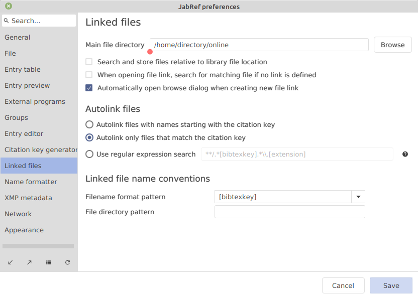

# Add entry using PDFs

## For one PDF file

The simplest way to create a new entry based on a PDF file is to drag & drop the file onto the table of entries \(between two existing entries\). JabRef will then analyze the PDF and create a new entry.

## For several PDF files

In case you have numerous PDF files and want to convert them into new entries, JabRef can search automatically for the PDF files, let you select the relevant ones, and convert them into new entries.

1. Go to **Lookup → Search for unlinked local files** \(or press `SHIFT + F7`\)

   

2. The _Find unlinked files_ dialog opens.

   

3. Choose a directory using the `Browse` button.
4. Click on `Scan directory`.
5. The files not yet contained in the database are shown.

   

6. Select the entries you are interested in. Note: the button `Export selected files` allows you to export the list of the selected files \(a text file containing on each line one filename with its path\)
7. Click on `Import`.

   The windows close and the entry table now contains the newly-imported entries.


The imported entries may need some editing because all the information gathered from the PDF files may not be accurate \(see below "PDFs for which it works"\).


## Further information

### PDFs for which it works

The PDF-content importer has been written for IEEE and [LNCS](https://github.com/latextemplates/LNCS) formatted papers. Other formats are not \(yet\) supported. In case a DOI is found on the first page, the DOI is used to generate the Bib\(la\)TeX information.

The next development step is to extract the title of the PDF, use the "Lookup DOI" and then the [Get BibTeX data from DOI](../finding-sorting-and-cleaning-entries/getbibtexdatafromdoi.md) functionality from JabRef to fetch the BibTeX data.

We are also [thinking about](https://github.com/koppor/jabref/issues/169) replacing the code completely by using another library. This is much effort and there is no timeline for that.

### Better filenames

JabRef also offers to change the filenames. You can adapt the pattern at **Options → Preferences → Linked files**.

In the section _Linked file name conventions_, you can select the _Filename format pattern_: `[citationkey] - [title]` or `[citationkey]`. Selecting `[citationkey] - [title]` results in the setting `\citationkey\begin{title} - \format[RemoveBrackets]{\title}\end{title}`. This makes the filenames start with the citation key followed by the full title. In the concrete case, `\citationkey` only maybe a better option as the described citation key already contains the title.

